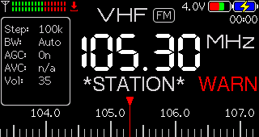

# Development

```{include} ../../CONTRIBUTING.md
```

## Video tutorial

A short video tutorial on how to build a custom firmware version:

<iframe width="720" height="405" src="https://rutube.ru/play/embed/1ff6fc7246260b3d404acebd0435d785?p=faQjyf7QWhT3bff2GDrReQ" frameBorder="0" allow="clipboard-write; autoplay" webkitAllowFullScreen mozallowfullscreen allowFullScreen></iframe>

## Compiling the source code

1. Install [Arduino CLI](https://arduino.github.io/arduino-cli/1.2/installation/).
2. Go to the repository root folder
3. Compile and flash the firmware

```shell
arduino-cli compile --clean -e -p COM_PORT -u ats-mini
```

## Compile-time options

The available options are:

* `DISABLE_REMOTE` - disable remote control over the USB-serial port
* `ENABLE_HOLDOFF` - enable delayed screen update while tuning
* `HALF_STEP` - enable encoder half-steps (useful for EC11E encoder)

To set an option, add the `--build-property` command line argument like this:

```shell
arduino-cli compile --build-property "compiler.cpp.extra_flags=-DENABLE_HOLDOFF" --clean -e -p COM_PORT -u ats-mini
```

## Enabling the pre-commit hooks

1. Install `uv` <https://docs.astral.sh/uv/getting-started/installation/>
2. Run `uv sync`
3. run `uv run pre-commit install --install-hooks`

## Using the make command

You can do all of the above using the `make` command as well:

```shell
ENABLE_HOLDOFF=1 PORT=/dev/tty.usbmodem14401 make upload
```

## Adding a changelog entry

1. Install `uv` <https://docs.astral.sh/uv/getting-started/installation/>
2. Run `uv sync`
3. Create an entry:
   ```
   uv run towncrier create --edit ID.CATEGORY.md
   ```
   `ID` is an issue or a PR number, or `+STRING` if there is no issue/PR. `CATEGORY` is one of `added`, `changed`, `fixed`, etc. see the `tool.towncrier.type` sections in the `pyproject.toml` for the full list.

## Improving the documentation

1. Install `uv` <https://docs.astral.sh/uv/getting-started/installation/>
2. Run `uv sync`
3. Run a local webserver `uv run sphinx-autobuild docs/source docs/build` and open the http://127.0.0.1:8000 in a browser
4. Edit the Markdown files in `docs/source` folder and immediately see your changes reflected in the browser

## Theme editor

A terminal command <kbd>T</kbd> toggles a special mode that helps you pick the right colors faster without recompiling and flashing the firmware each time. When the theme editor is enabled, some screen elements are always visible (and the battery indicator switches its state every 10 seconds):



Press <kbd>@</kbd> to print the current color theme to the serial console:

```shell
Color theme Default: x0000xFFFFxD69AxF800xD69Ax07E0xF800xF800xFFFFxFFFFx07E0xF800x001FxFFE0xD69AxD69AxD69Ax0000xD69AxD69AxF800xBEDFx0000xF800xFFFFxBEDFx105BxBEDFxBEDFxFFFFxD69AxF800xFFE0xD69AxFFFFxF800xC638
```

Then copy the theme to your favorite text editor, change the colors as you see (here is a handy [565 color picker](https://chrishewett.com/blog/true-rgb565-colour-picker/)).

To preview the theme, paste it to the serial console with the <kbd>!</kbd> character appended:

```shell
!x0000xFFFFxD69AxF800xD69Ax07E0xF800xF800xFFFFxFFFFx07E0xF800x001FxFFE0xD69AxD69AxD69Ax0000xD69AxD69AxF800xBEDFx0000xF800xFFFFxBEDFx105BxBEDFxBEDFxFFFFxD69AxF800xFFE0xD69AxFFFFxF800xC638
```

Once you are happy, add the resulting colors to `Theme.cpp`.

## Release process

1. Bump the `APP_VERSION` constant in the `Common.h` file
2. If the new version has a different EEPROM layout, bump the `EEPROM_VERSION` as well (it will force the EEPROM reset)
3. Generate the CHANGELOG.md by running `uv run towncrier build --version X.XX`
4. Add and commit the changes with a message like "Release X.XX", then push them to the repository
5. Once the build is complete, download, flash and test it!
6. Tag the release and push the tag `git tag -a vX.XX -m 'Version X.XX' && git push --follow-tags` (the tag should start with `v`!)
