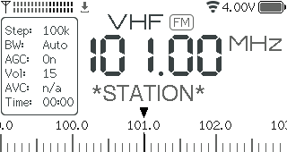

# User Manual

## Main screen



* **RSSI meter** (top left corner), also serves as a mono/stereo indicator in FM mode (one/two rows).
* **Settings save icon** (right after the RSSI meter). The settings are saved to non-volatile memory after 10 seconds of inactivity.
* **Wi-Fi icon** (top right area near the battery). Different colors indicate the connection status.
* **Battery status** (top right corner). It doesn't show the voltage when charged, see [#36](https://github.com/esp32-si4732/ats-mini/issues/36#issuecomment-2778356143). The only indication that the battery is charging is the hardware LED on the bottom of the receiver, which turns ON during charging.
* **Band name and modulation** (VHF & FM, top center). See the [Bands table](#bands-table) for more details.
* **Info panel** (the box on the left side), also **Menu**. The parameters are explained in the [Menu](#menu) section.
* **Frequency** (center of the screen).
* **FM station name** (RDS PS) or **frequency name** (right below the frequency). A frequency name appears for some popular frequencies like FT8, SSTV, CB channels, or a shortwave [schedule](#schedule). Can also display current **menu option** using a bigger font when the Zoom Menu setting is enabled.
* **Tuning scale** (bottom of the screen). Can be replaced with additional RDS fields (RT, PTY) when extended RDS is enabled.

## Alternative UI


The differences are:

* **Stereo indicator** is on the right side of the band and mode (VHF & FM).
* **Tuning scale** (right under the station name). Numbers on the left & right sides are the band limits.
* **S/N Meter** (in dB). The range is 0...127 and the visual indicator linearly displays this range.
* **RSSI & S-Meter** (the number is in dBµV, the meter is in S-points). Please note that the RSSI range is also 0...127 (no negative values) and according to [these tables](https://dl4zao.de/_downloads/Dezibel.pdf) any values below S4 on HF (rssi < 4) and below S7 on VHF (rssi < 2) are bogus. Thus it is very far from being precise, and also depends on the antenna impedance.

Both meters can be replaced with additional RDS fields (RT, PTY) when extended RDS is enabled.

## Controls

Controls are implemented through the encoder knob:

| Gesture                | Result                                                                |
|------------------------|-----------------------------------------------------------------------|
| Rotate                 | Tunes frequency, navigates menu, adjusts parameters.                  |
| Click (<0.5 sec)       | Opens menu, selects.                                                  |
| Short press (>0.5 sec) | Volume shortcut in VFO mode, context-dependent action in other modes. |
| Long press (>2 sec)    | Sleep on/off.                                                         |
| Press and rotate       | Direct frequency input mode, fine tuning in Seek mode.                |

### Direct frequency input mode

* Press and rotate the encoder to select the step (digit or "half-digit").
* Rotate the encoder to adjust the frequency.
* Use short press to align frequency to the current step.
* To exit the mode, click the encoder or wait for a couple of seconds.

## Menu

The menu can be invoked by clicking the encoder button and is closed automatically after a couple of seconds.

* **Mode** - FM (only available on the VHF band); LSB, USB, AM (available on other bands). The receiver doesn't support the NFM mode (on any band, including the CB) due to limitations of the SI4732 chip.
* **Band** - List of [Bands](#bands-table).
* **Volume** - 0 (silent) ... 63 (max). The headphone volume level can be low (compared to the built-in speaker) due to limitation of the initial hardware design. Use short press to mute/unmute.
* **Step** - Tuning step (not every step is available on every band and mode).
* **Seek** - Scan up or down (AM/FM), faster tuning (LSB/USB). Rotate or click the encoder to stop the scan. Use short press to switch between the scan and [schedule](#schedule) modes. Use press and rotate for manual fine tuning.
* **Memory** - 32 slots to store favorite frequencies. Click `Add` on an empty slot to store the current frequency, short press to erase a slot, switch between stored slots by rotating the encoder. It is also possible to edit the memory slots via [serial port](#serial-interface) or via the [web based tool](memory.md) in Google Chrome.
* **Squelch** - mute the speaker when the RSSI level is lower than the defined threshold. Unlikely to work in SSB mode. To turn it off quickly, short press the encoder button while in the Squelch menu mode.
* **Bandwidth** - Selects the bandwidth of the channel filter.
* **AGC/ATTN** - Automatic Gain Control (on/off) or Attenuation level. The attenuator is not applicable to SSB mode.
* **AVC** - Sets the maximum gain for automatic volume control (not applicable to FM mode).
* **SoftMute** - Sets softmute max attenuation (only applicable to AM/SSB).
* **Settings** - Settings submenu.

## Settings menu

* **Brightness** - Display brightness level (10...255). The minimal one draws about 80mA of the battery power, the default one about 100mA, the max level about 120mA.
* **Calibration** - SSB calibration offset (-2000...2000, per band).
* **RDS** - Radio Data System options: PS - radio station name, CT - time, RT - text, PTY - genre, ALL (EU/US) - everything. Note that the time can be transmitted either in UTC or in local timezone, as well as be completely bogus. The clock is synchronized only once, so you can pick the right time source (switch the receiver power off and on to resync it again).
* **UTC Offset** - Affects the displayed time, whether it was received via RDS or NTP.
* **FM Region** - FM de-emphasis time constant by region (50µs for EU/JP/AU and 70µs for the US).
* **Theme** - Color theme.
* **UI Layout** - Alternative UI layouts. For now there is just one alternative UI with large S-meter and S/N-meter.
* **Zoom Menu** - Display the currently selected menu item using a larger font (accessibility option).
* **Scroll Dir.** - Menu scroll direction for clockwise encoder turn.
* **Sleep** - Automatic sleep interval in seconds (0 - disabled).
* **Sleep Mode** - Locked - lock the encoder rotation during sleep; Unlocked - allow tuning the frequency in sleep mode; CPU Sleep - the maximum power saving mode. With the display being on, default brightness, and Wi-Fi the power consumption is about 170mA, without Wi-Fi 100mA, Locked/Unlocked modes draw about 70mA, CPU sleep mode draws about 40mA.
* **Load EiBi** - download the EiBi [schedule](#schedule) (requires Wi-Fi internet connection).
* **Wi-Fi** - Wi-Fi mode: Off (default), Access Point, Access Point + Connect, Connect, Sync Only. More details on that below.
* **About** - Informational screens (Help, Authors, System).

## Wi-Fi

The Wi-Fi mode (2.4GHz only) can be used for the following purposes (for now):

* Time synchronization via NTP (Network Time Protocol).
* Viewing the receiver status (frequency, RSSI/SNR, volume, battery voltage, etc).
* Viewing the Memory slots with saved frequencies.
* Manage the receiver settings.
* Backup/restore the settings (EEPROM). The restore function only works on compatible firmware versions (if the settings were changed significantly, the full reset is inavoidable).

There are a couple of modes:

* **Off** (default)
* **AP Only** - Access Point mode. The receiver creates its own access point called `ATS-Mini` and starts the web server on <http://10.1.1.1>.
* **AP+Connect** - Access Point mode + try to connect to one of the three configured access points. If the connection succeeds, the receiver will synchronize the time every 5 minutes and start the web server on both <http://10.1.1.1> and a dynamic IP address it got from the configured access point.
* **Connect** - try to connect to one of the three configured access points, start the web server on a dynamic IP, then synchronize the time every 5 minutes.
* **Sync Only** - same as Connect, but Wi-Fi will be disabled after a successful time synchronization.

Initial configuration:

* Enable the **AP Only** mode (the receiver will briefly display its 10.1.1.1 IP address).
* Connect to the `ATS-Mini` access point from your phone or computer. There is no internet connection available on this access point. When connecting from a phone, it might be necessary to switch off the mobile data connection and any VPN/firewall software.
* Open a browser and visit the following URL: <http://10.1.1.1>. The status web page should open.
* Click the `Config` link. Here you can add optional login and password to protect the settings page, configure up to three access points the receiver will try to connect to, and set a time zone and other settings.
* After that, switch the Wi-Fi mode to **AP+Connect** or **Connect** (the receiver will briefly show its new dynamic IP address it got from a configured access point).
* Now connect your phone/computer to the same access point and open the new URL to check whether the receiver connected to the internet.

From now on you can switch the modes as you want and connect to your receiver either via the `ATS-Mini` internal access point (if enabled, mostly useful when there are no access points around), or via an external access point and a dynamic IP address.

```{hint}
When on the go, you can set up a mobile Wi-Fi hotspot on your smartphone and use it to connect the receiver to the internet.
```

## Schedule

The receiver can download the [EiBi](http://eibispace.de/dx/eibi.txt) shortwave schedule and use it to display broadcasting stations, allowing you to quickly tune to them. Here’s how it works:

* The schedule only needs to be downloaded once via [Wi-Fi](#wi-fi). It will be stored in the receiver's flash memory so it doesn't need to be fetched every time the device powers on.
* To display scheduled stations correctly, the receiver’s clock must be set. The simplest and most battery-preserving way is to configure a Wi-Fi internet connection and then switch it to Sync Only mode. The UTC offset setting doesn’t matter, as the receiver syncs via NTP in UTC. A less reliable alternative is to use RDS CT, but this requires finding a station that broadcasts UTC time (not local time).
* Once set up, the receiver will display station names currently broadcasting on specific frequencies (only scheduled times are considered; days of the week are ignored for now).
* You can quickly jump between stations using the Seek mode (marked by a clock icon). To switch between modes, short press the encoder while in Seek mode.

## Reset

To reset the receiver settings (current band, frequency, favorite stations, downloaded schedule, etc):

1. Switch off the receiver
2. Press and hold the encoder
3. Turn on the receiver
4. Release the encoder after the `EEPROM Resetting` message appears


## Bands table

| Name | Min frequency | Max frequency | Default mode |
|------|---------------|---------------|--------------|
| VHF  | 64 MHz        | 108 MHz       | FM           |
| ALL  | 150 kHz       | 30000 kHz     | AM           |
| 11M  | 25600 kHz     | 26100 kHz     | AM           |
| 13M  | 21500 kHz     | 21900 kHz     | AM           |
| 15M  | 18900 kHz     | 19100 kHz     | AM           |
| 16M  | 17500 kHz     | 18100 kHz     | AM           |
| 19M  | 15100 kHz     | 15900 kHz     | AM           |
| 22M  | 13500 kHz     | 13900 kHz     | AM           |
| 25M  | 11000 kHz     | 13000 kHz     | AM           |
| 31M  | 9000 kHz      | 11000 kHz     | AM           |
| 41M  | 7000 kHz      | 9000 kHz      | AM           |
| 49M  | 5000 kHz      | 7000 kHz      | AM           |
| 60M  | 4000 kHz      | 5100 kHz      | AM           |
| 75M  | 3500 kHz      | 4000 kHz      | AM           |
| 90M  | 3000 kHz      | 3500 kHz      | AM           |
| MW3  | 1700 kHz      | 3500 kHz      | AM           |
| MW2  | 495 kHz       | 1701 kHz      | AM           |
| MW1  | 150 kHz       | 1800 kHz      | AM           |
| 160M | 1800 kHz      | 2000 kHz      | LSB          |
| 80M  | 3500 kHz      | 4000 kHz      | LSB          |
| 40M  | 7000 kHz      | 7300 kHz      | LSB          |
| 30M  | 10000 kHz     | 10200 kHz     | LSB          |
| 20M  | 14000 kHz     | 14400 kHz     | USB          |
| 17M  | 18000 kHz     | 18200 kHz     | USB          |
| 15M  | 21000 kHz     | 21500 kHz     | USB          |
| 12M  | 24800 kHz     | 25000 kHz     | USB          |
| 10M  | 28000 kHz     | 29700 kHz     | USB          |
| CB   | 25000 kHz     | 30000 kHz     | AM           |

## Serial interface

A USB-serial interface is available to control and monitor the receiver. Use [PuTTY](https://www.chiark.greenend.org.uk/~sgtatham/putty/latest.html) or Picocom to connect to the serial port. Alernatively, open the following web terminal in Google Chrome: <https://www.serialterminal.com/>. A list of commands:

| Button       | Function            | Comments                                                                                     |
|--------------|---------------------|----------------------------------------------------------------------------------------------|
| <kbd>R</kbd> | Rotate Encoder Up   | Tune the frequency up, scroll the menu, etc                                                  |
| <kbd>r</kbd> | Rotate Encoder Down | Tune the frequency down, scroll the menu, etc                                                |
| <kbd>e</kbd> | Encoder Button      | The <kbd>e</kbd> emulates a single push and can not be used for EEPROM reset or long press   |
| <kbd>V</kbd> | Volume Up           |                                                                                              |
| <kbd>v</kbd> | Volume Down         |                                                                                              |
| <kbd>B</kbd> | Next Band           |                                                                                              |
| <kbd>b</kbd> | Previous Band       |                                                                                              |
| <kbd>M</kbd> | Next Mode           | Next modulation                                                                              |
| <kbd>m</kbd> | Previous Mode       | Previous modulation                                                                          |
| <kbd>S</kbd> | Next step           |                                                                                              |
| <kbd>s</kbd> | Previous step       |                                                                                              |
| <kbd>W</kbd> | Next Bandwidth      |                                                                                              |
| <kbd>w</kbd> | Previous Bandwidth  |                                                                                              |
| <kbd>A</kbd> | AGC/Att Up          | Automatic Gain Control or Attenuator up                                                      |
| <kbd>a</kbd> | AGC/Att Down        | Automatic Gain Control or Attenuator down                                                    |
| <kbd>L</kbd> | Backlight Up        |                                                                                              |
| <kbd>l</kbd> | Backlight Down      |                                                                                              |
| <kbd>I</kbd> | Calibration Up      |                                                                                              |
| <kbd>i</kbd> | Calibration Down    |                                                                                              |
| <kbd>O</kbd> | Sleep On            |                                                                                              |
| <kbd>o</kbd> | Sleep Off           |                                                                                              |
| <kbd>t</kbd> | Toggle Log          | Toggle the receiver monitor (log) on and off                                                 |
| <kbd>C</kbd> | Screenshot          | Capture a screenshot and print it as a BMP image in HEX format                               |
| <kbd>$</kbd> | Show Memory Slots   | Show memory slots in a format suitable for restoring them after the reset                    |
| <kbd>#</kbd> | Set Memory Slot     | Example `#01,VHF,107900000,FM` (slot, band, frequency, mode). Set freq to 0 to clear a slot. |
| <kbd>T</kbd> | Theme Editor        | Toggle the [theme editor](development.md#theme-editor) on and off                            |
| <kbd>@</kbd> | Get Theme           | Print the current color theme                                                                |
| <kbd>!</kbd> | Set Theme           | Set the current color theme as a list of HEX numbers (effective until a power cycle)         |

```{hint}
To edit/backup/restore the Memory slots, you can open this [web based tool](memory.md) in Google Chrome.
```

The following comma separated information is sent out on the serial interface when the monitor (log) mode is enabled:

| Position | Parameter        | Function          | Comments                            |
|----------|------------------|-------------------|-------------------------------------|
| 1        | APP_VERSION      | F/W version       | Example 201, F/W = v2.01            |
| 2        | currentFrequency | Frequency         | FM = 10 kHz, AM/SSB = 1 kHz         |
| 3        | currentBFO       | BFO               | SSB = Hz                            |
| 4        | bandCal          | BFO               | SSB = Hz                            |
| 5        | bandName         | Band              | See the [bands table](#bands-table) |
| 6        | currentMode      | Mode              | FM/LSB/USB/AM                       |
| 7        | currentStepIdx   | Step              |                                     |
| 8        | bwIdx            | Bandwidth         |                                     |
| 9        | agcIdx           | AGC/Attn          |                                     |
| 10       | volume           | Volume            | 0 to 63 (0 = Mute)                  |
| 11       | remoteRssi       | RSSI              | 0 to 127 dBuV                       |
| 12       | remoteSnr        | SNR               | 0 to 127 dB                         |
| 13       | tuningCapacitor  | Antenna Capacitor | 0 - 6143                            |
| 14       | remoteVoltage    | ADC average value | Voltage = Value x 1.702 / 1000      |
| 15       | remoteSeqnum     | Sequence number   | 0 to 255 repeating sequence         |

In SSB mode, the "Display" frequency (Hz) = (currentFrequency x 1000) + currentBFO

### Making screenshots

The screenshot function is intended for interface and theme designers, as well as for the documentation writers. It dumps the screen to the serial console as a BMP image in the HEX format. To convert it to an image file, you need to convert the HEX string to binary format.

A quick one-liner for macOS and Linux (change the `/dev/cu.usbmodem14401` serial port name as needed):

```shell
echo -n C | socat stdio /dev/cu.usbmodem14401,echo=0,raw | xxd -r -p > /tmp/screenshot.bmp
```
